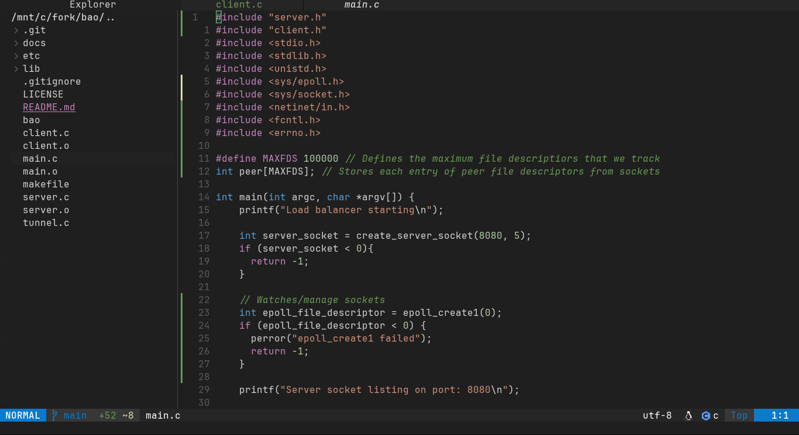

# Juno

My personal Neovim configuration with theme, fuzzy file search, and live grep, managed by [lazy.nvim](https://github.com/folke/lazy.nvim).

## Installation

Before installing, make sure you have the following installed:

- **Neovim** >= 0.9
- **Git**
- **Ripgrep** — used for live grep search inside files

This configuration includes LSP support for Go, JavaScript and TypeScript.

**Go & JavaScript & TypeScript**
```bash
npm install -g typescript-language-server typescript
go install golang.org/x/tools/gopls@latest
```

### Windows (PowerShell)

```powershell
git clone https://github.com/thijsrijkers/juno $env:LOCALAPPDATA\nvim
nvim
```

### macOS & Linux

```bash
git clone https://github.com/thijsrijkers/juno ~/.config/nvim
nvim
```

On first launch, lazy.nvim will automatically install all plugins. Wait for it to finish, then restart Neovim.

---

## Uninstall / Reset

If you want a clean reinstall, remove the config and plugin data first.

### Windows (PowerShell)
```powershell
Remove-Item -Recurse -Force $env:LOCALAPPDATA\nvim
Remove-Item -Recurse -Force $env:LOCALAPPDATA\nvim-data
```

### macOS & Linux
```bash
rm -rf ~/.config/nvim
rm -rf ~/.local/share/nvim
rm -rf ~/.local/state/nvim
rm -rf ~/.cache/nvim
```

Then run the installation steps again.

---

## Example of deployment




## Plugins

| Plugin | Purpose |
|---|---|
| `sainnhe/everforest` | Everforest colour scheme |
| `telescope.nvim` | Fuzzy file finder and live grep |
| `nvim-tree.lua` | File explorer sidebar |
| `lualine.nvim` | Status line |
| `bufferline.nvim` | Tab bar |
| `nvim-treesitter` | Syntax highlighting |
| `which-key.nvim` | Keybinding popup guide |
| `nvim-autopairs` | Auto-close brackets and quotes |
| `Comment.nvim` | Toggle comments |
| `gitsigns.nvim` | Git changes in the gutter |
